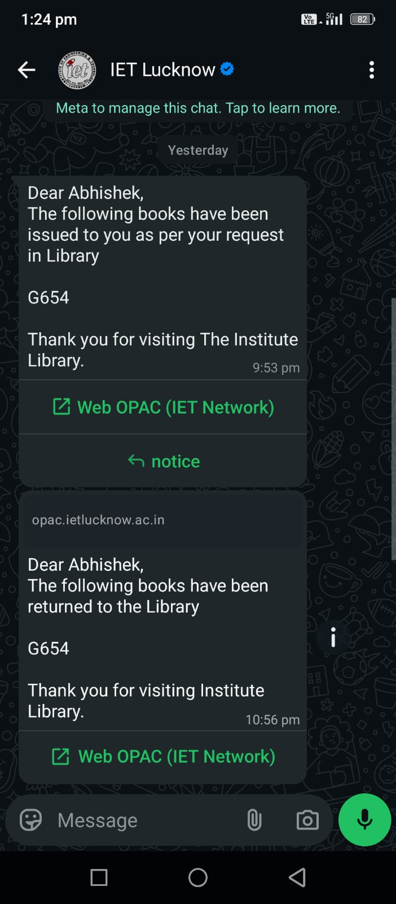

# gupshup-wa-koha-driver
Notice Driver for Koha to implement Gupshup WhatsApp API

Motivation

Koha already have a feature to Push Notices via SMS

Koha uses SMS Drivers to push these Notices to a Service Provider

SMS Driver can be written which can Push Notices using an External API (Gupshup WhatsApp API) in this case which can inturn send the Notice as WhatsApp Messages.

Requirements

1) Facebook Business Account
2) GupShup Account with WhatsApp Business API
3) GupShup API Key
4) Approved Templates for CHECKOUT, CHECKIN, DUE
5) GupShup Endpoint URL for API
6) SOURCE Number as Registered in Facebook Business Account and Mapped in Gupshup

How to Install
1) Download the Package File (.KPZ) from this github Repository
2) Upload the Package File in the Koha Plugins
3) Confugure the Plugin by entering the Infomation already stated in Requirements
4) Modify the SMSSendDriver Value to SMS::Send::Gs in the System Preferences in Koha
5) Enable Notices via SMS in Koha for desired category of Patrons
6) Configure the messages cron if not already configuredon Koha Server

Assumptions of this Driver

Template for CHECKOUT, CHECKIN, DUE is already approved by Facebook and contains 2 Variables/Parameters

eg Template
_______________________________________________________
Dear {{1}},

The following books have been issued to you as per your request in Library

{{2}}

Thank you for visiting The Institute Library.
_______________________________________________________

The Driver will replace {{1}} with the Patron First Name & {{2}} will be replaced with the SMS Template Data as recieved from KOHA
eg {{2}} can contain Barcode of Books issued which will convert the Template to the following and send

_______________________________________________________________________________
Dear Abhishek,

The following books have been issued to you as per your request in Library

6754, 5754

Thank you for visiting The Institute Library.
________________________________________________________________________________

